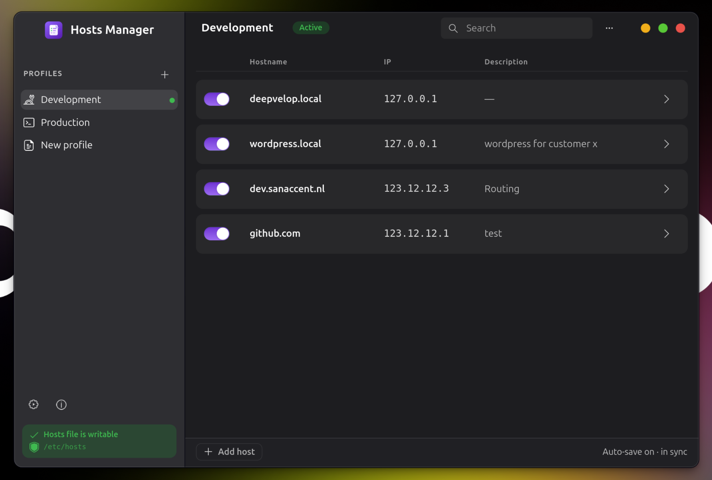
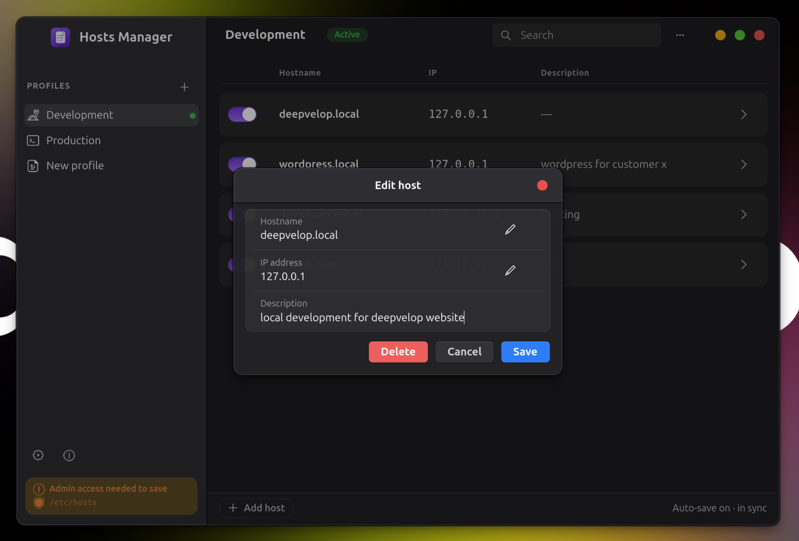
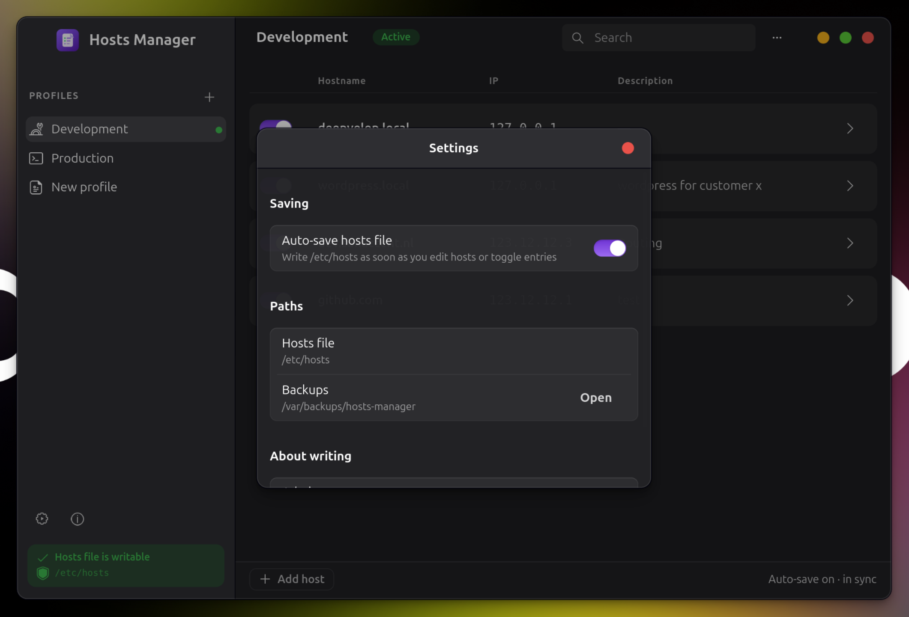

# Hosts Manager

Native GNOME app for managing `/etc/hosts` with profile overlays.

Built with **Python**, **GTK 4**, and **libadwaita**. The GUI runs as your normal user — only writes to the hosts file are elevated through **PolicyKit** / `pkexec`.


---

## Screenshots

> Replace the placeholders below with real screenshots in `screenshots/`.


| Main window                                    | Profiles                                 |
| ---------------------------------------------- | ---------------------------------------- |
|  |  |


| Host editor                                    | Settings                                 |
| ---------------------------------------------- | ---------------------------------------- |
|  |  |


---


## Features

- **Profile overlays** — Development, Staging, Production, or your own profiles
- **Active / Inactive badge** — enable a profile in `/etc/hosts` instantly
- **Per-host toggles** — turn individual entries on or off
- **Inline descriptions** — stored as `# comments` next to each host
- **Safe writing** — preserves unmanaged lines outside the managed block
- **Validation** — IP addresses and hostnames are checked before save
- **Diff before Save** — review `+` / `-` changes when auto-save is off
- **Auto-save** — optional setting to write the hosts file as you edit
- **Import existing hosts** — entries already in `/etc/hosts` are detected and moved into an enabled "Existing hosts" profile; unparsable lines get a per-line review (line number, content, fault) with Edit / Remove / Retry
- **Backups** — automatic backups before every privileged write
- **Session auth** — admin access once per session; no re-prompt for every save
- **Never runs as root** — the GUI stays unprivileged; only a small helper is elevated

---


## Installation


### Option 1 — Install from source (`./install.sh`)

**1. Install dependencies** (Ubuntu 24.04+ / Debian with GTK 4):

```bash
sudo apt update
sudo apt install python3 python3-gi python3-gi-cairo gir1.2-gtk-4.0 gir1.2-adw-1 policykit-1 git
```

**2. Clone the repository:**

```bash
git clone https://github.com/deepvelop/linux-hosts-manager.git
cd linux-hosts-manager
```

**3. Install system-wide:**

```bash
sudo ./install.sh
```

By default this installs under `/usr/local`. To install under `/usr` instead:

```bash
sudo PREFIX=/usr ./install.sh
```

**4. Launch the app:**

- From the app grid: **Hosts Manager**
- Or from a terminal:

```bash
hosts-manager
```

**What gets installed:**


| Component         | Path                                                                  |
| ----------------- | --------------------------------------------------------------------- |
| Launcher          | `/usr/local/bin/hosts-manager`                                        |
| App files         | `/usr/local/share/hosts-manager/`                                     |
| Privileged helper | `/usr/local/libexec/hosts-manager-helper`                             |
| Polkit policy     | `/usr/local/share/polkit-1/actions/com.deepvelop.HostsManager.policy` |
| Desktop entry     | `/usr/local/share/applications/com.deepvelop.HostsManager.desktop`    |


Profiles are stored in `~/.config/hosts-manager/`.

---


### Option 2 — Flatpak (Flathub)

> **Coming soon** — a Flatpak package is planned for Flathub.

When published, installation will look like:

```bash
flatpak install flathub com.deepvelop.HostsManager
flatpak run com.deepvelop.HostsManager
```

---


### Option 3 — Snap Store

> **Coming soon** — a Snap package is planned for the Snap Store.

When published, installation will look like:

```bash
sudo snap install hosts-manager --classic
```

---


## How it works

1. Edit profiles and host entries in the app (saved locally right away).
2. Enabled profiles are merged into a managed block in `/etc/hosts`:
  ```
   # BEGIN Hosts Manager
   # Profile: Development
   127.0.0.1 app.local  # Local application
   # END Hosts Manager
  ```
3. With **auto-save** off, press **Save** and review the diff.
4. With **auto-save** on (or when toggling **Active**), the hosts file is updated immediately after admin approval.
5. Everything outside the managed block is left untouched.

### Importing existing hosts

On first launch — and whenever `/etc/hosts` changes outside the app — Hosts Manager offers to import unmanaged entries into an enabled "Existing hosts" profile:

1. Entries outside the managed block are moved into it, reformatted by the app.
2. Lines that can't be parsed are listed with their line number, content, and the fault.
3. Fix a line with **Edit**, drop it with **Remove**, then press **Retry** to re-validate.
4. **Import** is enabled once every line is resolved; the resulting diff is shown before anything is written.

Tip: rewriting a problem line so it starts with `#` keeps it in the hosts file as a comment instead of importing it. The profile menu's **Import Existing Hosts** re-runs the scan at any time.

---


## Security

- Never run `sudo python app.py` or `sudo hosts-manager`.
- The GUI never writes `/etc/hosts` directly.
- Duplicate hostnames across enabled profiles are blocked.
- Hostnames that already exist outside the managed block are blocked.
- The privileged helper re-validates input, creates a backup, and writes atomically.

---


## Development

```bash
# Optional venv with system GI packages
uv venv --python /usr/bin/python3 --system-site-packages .venv
uv pip install --python .venv/bin/python pytest

# Run from source
python app.py

# Safe testing with a fake hosts file
mkdir -p /tmp/hosts-manager-smoke/backups
printf '127.0.0.1\tlocalhost\n' > /tmp/hosts-manager-smoke/hosts
export HOSTS_MANAGER_SKIP_POLKIT=1
export HOSTS_MANAGER_HOSTS_PATH=/tmp/hosts-manager-smoke/hosts
export HOSTS_MANAGER_BACKUP_DIR=/tmp/hosts-manager-smoke/backups
python app.py

# Tests
.venv/bin/pytest -q
```
---


## Contributing & support

Code contributions, bug reports, and ideas are welcome — open an issue or pull request.

---


## License

Licensed under the [Apache License 2.0](LICENSE).

You are free to use, modify, and distribute this software — including commercially — under the terms of the Apache License 2.0.
